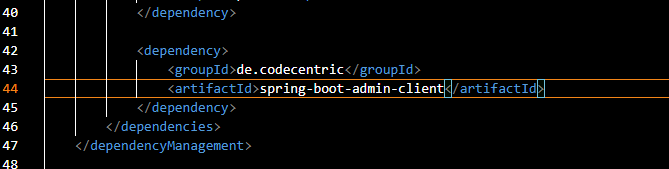

# Java 風格指導


## 監控

這邊採用 `spring boot admin` 方式監控項目

需要先執行 `spring boot admin server` 


### 配置項目admin Client




配置 server 端位置

```sh
./application.properties

# 添加 
spring.boot.admin.client.url=http://<ip:>


```

